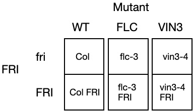
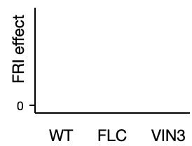

```{r setup, include=FALSE}
library(learnr)
knitr::opts_chunk$set(echo = FALSE)
library(ggplot2)  # for making nice plots
library(cowplot)  # for making nicer plots
library(emmeans)  # for extracting the results of an analysis
library(lme4)     # for fitting models to more complex experimental designs
library(lmerTest) # for better hypothesis tests
library(pbkrtest) # for better hypothesis tests
library(multcomp) # for better hypothesis tests
library(multcompView) # for better hypothesis tests
library(PLS205)   # additional helper functions I've written for teaching

bolting_data_1 = read.csv('data/Bolting_experiment_1.csv')
```

## Intro to R programing

### R operations

```{r intro1, exercise=TRUE, exercise.lines = 25}
'Hello world'

# A comment

2*3
(1+2+3)/3
2^3

sqrt(4) # square root
inverse(3)

5 > 3    # > is greater than, < is less than
6 == 5   # two equal signs is the logical test (is equal to). (One equal sign is assignment. see below)
5 != 3   # not equal to
5 >= 5   # greater than or equal to


# compare text (character strings)
"bookshelves" == "a totally different character"
"apples" != "oranges"
"apples" == "Apples" # R is always case-sensitive
```

### R programing

```{r intro2, exercise=TRUE, exercise.lines = 25}
library(lme4)    # access to modeling functions
library(ggplot2) # access to nice plots

# assign variable x to be 5 and y to be 6
x <- 5
y <- 6
# add x and y
x + y

# functions
mean(c(1,2,3)) # calculates the mean
qnorm(p = 0.95,mean = 10,sd = 3) # finds the 0.95 critical value of a normal 
m3 = mean(c(1,2,3))
m3

# data
iris <- read.csv('data/iris_data.csv')  # default function
iris
str(iris)
summary(iris)

```

### R plots


```{r intro3, exercise=TRUE, exercise.lines = 25}
# using the ggplot library 
library(ggplot2)
# tell ggplot what columns to use for "aes"thetics 
ggplot(iris,aes(x=Sepal.Length,y=Sepal.Width)) + 
  # add a scatter plot with geom_point and tell it to use the 'Species" column for color
  geom_point(aes(color = Species)) +
  # add a title!
  ggtitle('Iris Sepals')

```

## Description of the experiment and goals

### Burghardt, et al. (2016)

Burghardt, et al. (2016) reported on an experiment on the interaction of genetics and fluctuating environmental triggers on the control of flowering time in Arabidopsis thaliana.
The overall goal was to study the impact of fluctuating vs. constant environmental factors on the genetic control of flowering time.
I will re-frame the experiment slightly and work with a reduced version of the experiment in this tutorial.

Burghardt, et al. ran an experiment to measure the effect of the FRIGIDA (FRI) gene on flowering time.
FRI is a well-known flowering repressor.
It works by activating the MADS-box transcription factor FLOWERING LOCUS C (FLC), which represses both the florigin gene FT, as well as the meristem integrator gene SOC1.
In the full experiment, Burghardt, et al. measured the combined effects of various environmental and genetic perturbations on the effect of the FRI gene on the number of days from germination until the plant bolted, which is a sign that it has irreversibly committed to flowering.
In our first analysis, we will focus on the effects of mutational disruptions of two related genes: FLC, and VERNALIZATION INSENSITIVE 3 (VIN3).

### Goal:

Measure **the effect** of functional/non-functional FRI on flowering time in Arabidopsis, and evaluate how the effect of FRI is **modified** by the activity of two other genes: FLC and VIN3.

### Experimental Design:

Six genotypes of Arabidopsis were grown:

| Genotype   | Intact and functional genes            |
|------------|----------------------------------------|
| Col        | FLC and VIN3 (non-functional FRI)      |
| Col FRI    | FLC, VIN3, and FRI                     |
| flc-3      | VIN3 (non-functional FRI, mutated FLC) |
| flc-3 FRI  | VIN3 and FRI (mutated FLC)             |
| vin3-4     | FLC (non-functional FRI, mutated VIN3) |
| vin3-4 FRI | FLC and FRI (mutated VIN3)             |

Eight plants of each of the six genotypes were randomized inside a single chamber set to 22C, 16hrs light, constant temperatures.
The date of bolting was recorded for each plant.

### Objectives:

Report the effect of introgressing a functional FRI gene on flowering time for each of the three genotypes: *Col*, *flc-3*, and *vin3-4*.
Specifically: **How much does mutating** FLC **or** VIN3 **modify the effect of** FRI **on flowering time?**

## Analysis 1 - Load data

### 1. Load data

Data from: Burghardt, *et al.* (2016).
Fluctuating, warm temperatures decrease the effect of a key floral repressor on flowering time in *Arabidopsis thaliana.* New Phytologist.
210: 564-576.
<https://doi.org/10.1111/nph.13799>

Data link: <http://dx.doi.org/10.5061/dryad.65d76>

**Note**: I have pre-processed the data to extract a simpler data set for this tutorial.

Most data are stored in spreadsheets.
It is best to store spreadsheets in text formats like `csv` or `tsv`.
This makes them easier to load into `R`.

Our data is stored in a comma-separated-values table, so we'll use the `read.csv()` function.

We have to tell it the **file name** and the **folder name** *if it is not in the folder where this script is saved*.

The file is: `Bolting_experiment_1.csv` and it is in the `data` folder.

> Enter: `folder/file.csv` into the code box below between the `''` characters.

```{r ex1, exercise=TRUE, exercise.lines = 5}
bolting_data_1 = read.csv('')
```

When you run the command, you won't see anything happen unless there are errors.
We'll check that it worked right next ...


## Analysis 1 - Viewing the data
### 2. Viewing the data

It is good to have the file open in `Excel` to compare to how `R` sees it.

There are various ways to view a data table in `R`:

1.  Type the name of the `variable` (in this case: `bolting_data_1`)
2.  Type `str(bolting_data_1)`
3.  In the console, type `View(bolting_data_1)`
4.  In the `Environment` panel, click on `bolting_data_1`.

Try these below or in the Console.

**Note**: the Console is independent of the `learnr` tutorial.
You'll need to re-load the data there using:

`bolting_data_1 = read.csv('data/Bolting_experiment_1.csv')`

```{r view1,exercise=TRUE}

```

### 3. Explore / Visualize the data

It is always a good idea to do some initial visualizations of your data before analyzing, to check for outliers that might be data errors, and to get an idea of what patterns you should expect.

Note that these visualizations won't necessarily represent the correct analysis we will do, so don't rely on them to draw conclusions.

We will use plotting functions from the `ggplot` package

```{r plot1,exercise=TRUE}
plot1 = ggplot(bolting_data_1,aes(x=FRI,y=Days.to.Bolt)) + 
  geom_jitter(width = 0.1,aes(color = FRI))
plot1
```

### Improve the plots:

Here is the plot code again:

```{r plot2,exercise=TRUE}
plot1 = ggplot(bolting_data_1,aes(x=FRI,y=Days.to.Bolt)) + 
  geom_jitter(width = 0.1,aes(color = FRI))
plot1
```

Add the following one-at-a-time:

This code will separate the points by the moderator genotype:

`+ facet_grid(~mutant)`

This code before the plot will re-order the facets:

`str(bolting_data_1$mutant)`

`bolting_data_1$mutant = factor(bolting_data_1$mutant,levels = c('WT','flc-3','vin3-4'))`

This code will adjust the plot to look nicer:

`+ expand_limits(y=0) + theme_bw() + theme(legend.position = 'none')`

**Note** When building a plot, as long as the line ends with a `+`, the command will continue onto the next line.
If instead you add the geoms to the `plot1` statement at the end, these will not be saved if you use `plot1` later (*e.x.* for saving the plot).

### Saving your plots

If you want to save a plot for a publication, you can use the `save_plot()` function:

```{r prep_plot1,exercise=F,include=F}
str(bolting_data_1$mutant) 
bolting_data_1$mutant = factor(bolting_data_1$mutant,levels = c('WT','flc-3','vin3-4'))
plot1 = ggplot(bolting_data_1,aes(x=FRI,y=Days.to.Bolt)) + 
  geom_jitter(width = 0.1,aes(color = FRI)) + 
  facet_grid(~mutant) +
  expand_limits(y=0) + 
  theme_bw() + theme(legend.position = 'none') 
```

```{r save_plot1,exercise=TRUE, exercise.setup = 'prep_plot1'}
save_plot('Expt1_visualization.pdf',plot1,base_width = 3.7,base_height = 2)
```

## Analysis 1 - Run the analysis
### 4. Run the analysis

Once you are confident that your data have loaded correctly, the steps of the analysis are:

1.  Fit a model to the data
2.  Compute the cell means for each level of the **focal treatment** separately for each level of all **moderator treatments**.
3.  Compute the **focal treatment effects** separately for each level of all **moderator treatments**.
4.  Compare the focal treatment effects **among levels of** the moderator treatments

### Fit the model

```{r fix_data,exercise=FALSE}
bolting_data_1$mutant = factor(bolting_data_1$mutant,levels = c('WT','flc-3','vin3-4'))
```

This is code to fit the model:

```{r model1,exercise=TRUE, exercise.setup = 'fix_data'}
str(bolting_data_1)
bolting_model = lm(Days.to.Bolt ~ FRI + mutant + FRI:mutant, data = bolting_data_1)
```

We'll go over it in detail later.
But the key parts are:

1.  model function: `lm(response ~ terms, data = data_table_object)`
2.  `response` and each name in `terms` is a column of `data_table_object`
3.  `FRI + mutant + FRI:mutant` is the standard notation for a factorial experiment.
4.  We save the fitted model in a variable for further analyses

### Compute the treatment effects

We have two treatments: FRIGIDA (FRI vs fri) and mutant (WT vs flc vs vin3)

In total, there are 6 treatment combinations (FRI:mutant)

Think of them as arranged in a grid like this:



Using the fitted model, we will compute the treatment effects of interest, using the following steps:

1.  Compute the cell means for each treatment combination
2.  Compute the **focal treatment** effects at each level of the moderator
3.  Regroup the effects by focal treatment effect
4.  Compute the effects of each moderator level on each focal treatment

### Compute the cell means for each treatment combination

```{r cell_means,exercise = TRUE,exercise.setup ='model1'}
bolting_means = emmeans(bolting_model,specs = 'FRI',by = 'mutant')
print(bolting_means)
```

### Compute the **focal treatment** effects at each level of the moderator - By Hand!

> **Activity** 
>
> Compute the **FRI effects** by hand

| Mutant | FRI effect (FRI - fri) |
|--------|------------------------|
|        |                        |
|        |                        |
|        |                        |
|        |                        |

### Compute the **focal treatment** effects at each level of the moderator

Now, here's how to do it with *R*:

```{r FRI_effects,exercise = TRUE,exercise.setup ='cell_means'}
FRI_effects = contrast(bolting_means,'trt.vs.ctrl',ref = 'fri',name = 'FRI_effect')
print(FRI_effects)
```

> Activity Draw the FRI effects



### Plot the FRI effect estimates

```{r plot_FRI_effects,exercise = TRUE,exercise.setup ='FRI_effects'}
plot(FRI_effects,horizontal = FALSE) + facet_grid(~mutant)
```

> **Activity** 
> 
> - What should we conclude about the effect of FRI?
> - What should we conclude about the moderators?

### Compare the FRI effects among the mutants - Regroup

To compare effects, they have to be in the same `by`-group.
We need to regroup the FRI effects so they can be compared.

This step is necessary, but will make more sense when we have a more complicated experiment later.

```{r regroup_FRI_effects,exercise = TRUE,exercise.setup ='FRI_effects'}
regrouped_FRI_effects = update(FRI_effects,by = 'FRI_effect')
print(regrouped_FRI_effects)
```

### Compare the FRI effects among the mutants

Now, compare the FRI effects for each mutant against the FRI effects for Col (*i.e.* `WT`) using `contrast():`

```{r mutant_FRI_effects,exercise = TRUE,exercise.setup ='regroup_FRI_effects'}
mutant_effect_on_FRI_effects = contrast(regrouped_FRI_effects,'trt.vs.ctrl',ref = 'WT',name = 'mutant_effect')
print(mutant_effect_on_FRI_effects)
```


> **Activity** 
> 
> Explain the `estimate` value to your neighbor. Can you estimate these *by eye* using the plots above?
>
> State what you learned about the combined effect of these three genes on flowering.

### Alternatively, we can make a Compact Letter Display

```{r cld_mutant_FRI_effects,exercise = TRUE,exercise.setup ='regroup_FRI_effects'}
print(cld(regrouped_FRI_effects,Letters = letters))
```

Note: for compact letter displays, ignore the "SE", "df", "t.ratio" and "p.value" columns!

## Full code for the analysis

```{r full_code,exercise=TRUE,exercise.lines = 21}
bolting_data_1 = read.csv('data/Bolting_experiment_1.csv')
bolting_data_1$mutant = factor(bolting_data_1$mutant,levels = c('WT','flc-3','vin3-4'))
str(bolting_data_1)

bolting_model = lm(Days.to.Bolt ~ FRI + mutant + FRI:mutant, bolting_data_1)

bolting_means = emmeans(bolting_model,specs = 'FRI',by = 'mutant')
print(bolting_means)

FRI_effects = contrast(bolting_means,'trt.vs.ctrl',ref = 'fri',name = 'FRI_effect')
print(FRI_effects)

regrouped_FRI_effects = update(FRI_effects,by = 'FRI_effect')
print(regrouped_FRI_effects)

mutant_effect_on_FRI_effects = contrast(regrouped_FRI_effects,'trt.vs.ctrl',ref = 'WT',name = 'mutant_effect')
print(mutant_effect_on_FRI_effects)

plot(FRI_effects,horizontal = FALSE) + 
  facet_grid(~mutant) +
  theme_bw()
```

