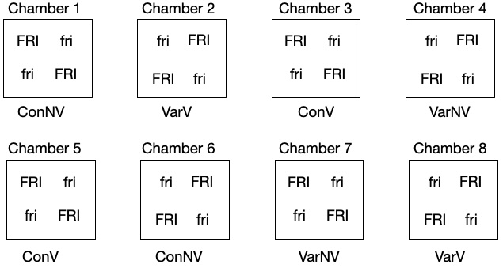

```{r setup, include=FALSE}
library(ggplot2)  # for making nice plots
library(cowplot)  # for making nicer plots
library(emmeans)  # for extracting the results of an analysis
library(lme4)     # for fitting models to more complex experimental designs
library(lmerTest) # for better hypothesis tests
library(pbkrtest) # for better hypothesis tests
library(multcomp) # for better hypothesis tests
library(multcompView) # for better hypothesis tests
library(PLS205)   # additional helper functions I've written for teaching
```

## Background

Recall the experimental layout:



In the tutorial, we analyzed the experiment with `FRI` as the focal treatment and `Treatment.V` as the moderator treatment.

In these two activites you will:

1.  Flip the analysis around and treat `Treatment.V` as the focal treatment, and `FRI` as a moderator.
2.  Analyze two sub-experiments:
3.  An experiment testing the effect of `Treatment.V` using only the *Col FRI* plants.
4.  An experiment testing the effect of `FRI` using only the *22ConLDNV* condition.

### 1. Re-load the dataset if needed

```{r, results = 'hide', message=FALSE}
# load data
bolting_data_FRI = read.csv('data/Bolting_experiment_3.csv')

# clean data
bolting_data_FRI$Chamber = factor(bolting_data_FRI$Chamber)
bolting_data_FRI$Genotype = factor(bolting_data_FRI$Genotype)
bolting_data_FRI$FRI = factor(bolting_data_FRI$FRI)
bolting_data_FRI$mutant = factor(bolting_data_FRI$mutant)
bolting_data_FRI$Treatment.V = factor(bolting_data_FRI$Treatment.V)
bolting_data_FRI$Pot = factor(bolting_data_FRI$Pot)

# view data
str(bolting_data_FRI)
```

### 2. Original analysis code - effects of Treatment.V on FRI effects

```{r}
# fit model
splitplot_model = lmer(inverse(Days.to.Bolt/100) ~ FRI + Treatment.V + FRI:Treatment.V +
                         (1|Chamber) + (1|FRI:Chamber),
                       data = bolting_data_FRI)

# extract results

splitplot_means = emmeans(splitplot_model,specs = 'FRI',by = 'Treatment.V')

FRI_effects = contrast(splitplot_means,'trt.vs.ctrl',by = 'Treatment.V',name = 'FRI_effect')

regrouped_FRI_effects = update(FRI_effects,by = 'FRI_effect')

trt_effect_on_FRI_effects = contrast(regrouped_FRI_effects,'pairwise')
print(summary(trt_effect_on_FRI_effects,infer = T))
```

## Activity 3 - Report the effect of FRI on the difference in flowering between the 4 conditions


> Before you begin, answer these questions with your partners
>
> 1.  How many `Treatment.V` effects will you measure? List them
> 2.  Explain what the **effect of FRI** on *the difference in flowering between the 4 conditions* means. Use a figure to explain

### Do your analysis here

Include tables and figures of the results

```{r}
splitplot_means = emmeans(splitplot_model,specs = 'Treatment.V',by = 'FRI')
print(splitplot_means)

TRT_effects = contrast(splitplot_means,'pairwise',by = 'FRI',name = 'TRT_effect')
print(TRT_effects)

regrouped_TRT_effects = update(TRT_effects,by = 'TRT_effect')
print(regrouped_TRT_effects)

fri_effect_on_TRT_effects = contrast(regrouped_TRT_effects,'pairwise')
print(summary(fri_effect_on_TRT_effects,infer = T))
```

```{r}
plot(TRT_effects,horizontal = F) + facet_wrap(~FRI)
plot(regrouped_TRT_effects,horizontal = F) + facet_wrap(~TRT_effect)
```

## Activity 4a - Analyze sub-experiments

Consider only the *Col FRI* samples:


This is still a complete experiment.

> Before you proceed, explain what treatment effects you can study here

This code will reduce the data to only this sub-experiment

```{r}
bolting_data_subExperiment = subset(bolting_data_FRI,Genotype == 'Col FRI')
str(bolting_data_subExperiment)
```

### Step 1: Create a design table

**Hint**: The table will end up with many fewer rows than for the full analysis!

| Structure | Variable                  | N. levels | Block | EU  |
|-----------|---------------------------|-----------|-------|-----|
| Response  | inverse(Days.to.Bolt/100) |           |       |     |
|           |                           |           |       |     |
|           |                           |           |       |     |
|           |                           |           |       |     |
|           |                           |           |       |     |

### Step 2: Write a model

**Hints**: 

1. The rows will be a subset of the rows of the original table
2. Within each row, only `N. levels` should change relative to the original table.
3. Follow the steps described in the lecture. These are saved here: `Making_a_Design_Table.pdf`

```{r}

```

### Step 3: Compute the treatment effects

```{r}

```

**Hint**: The functions you'll use are `emmeans()` and `contrast()`.

### Step 4: Make a report

**Hint**: The functions you'll use are `plot()`, `print(summary(,infer=T))`, and/or `print(cld())`.

```{r}

```


## Activity 4b - Analyze sub-experiments

Consider only the *22ConLDNV* samples:


This is still a complete experiment.

> Before you proceed, explain what treatment effects you can study here

This code will reduce the data to only this sub-experiment

```{r}
bolting_data_subExperiment = subset(bolting_data_FRI,Treatment.V == '22ConLDNV')
str(bolting_data_subExperiment)
```

### Step 1: Create a design table

**Hint**: The table will end up with many fewer rows than for the full analysis!

| Structure | Variable                  | N. levels | Block | EU  |
|-----------|---------------------------|-----------|-------|-----|
| Response  | inverse(Days.to.Bolt/100) |           |       |     |
|           |                           |           |       |     |
|           |                           |           |       |     |
|           |                           |           |       |     |
|           |                           |           |       |     |

### Step 2: Write a model

```{r}

```


### Step 3: Compute the treatment effects

```{r}

```

### Step 4: Make a report

```{r}

```


